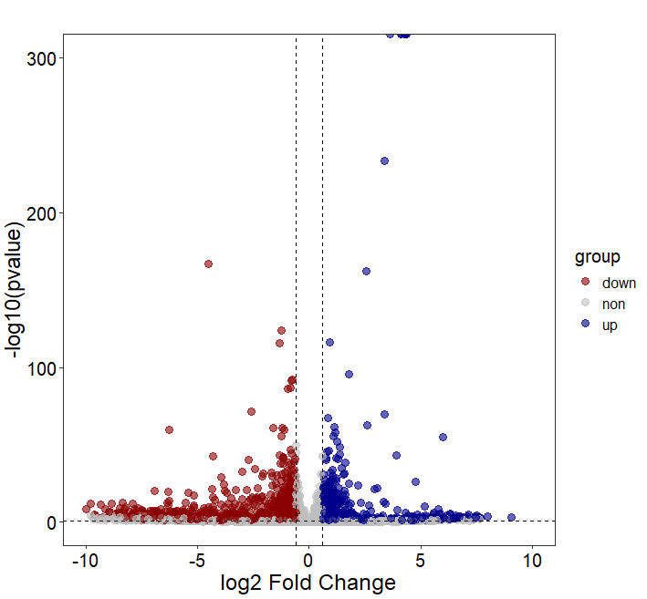
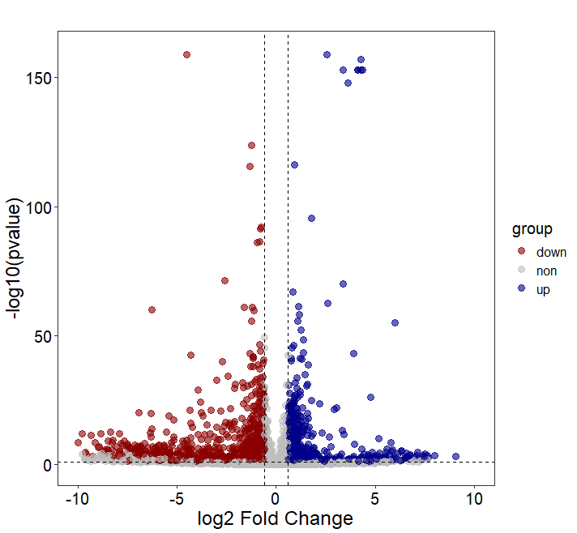

### Adjusting extremely small p-values in a volcano plot

.

When creating a volcano plot for differential gene expression, a few points (genes) with extremely small or even zero p-values can cause the Y-axis range to become very large. To zoom in Y-axis, it’s often necessary to either remove these extremely small p-values or replace them with more reasonable values.

.

This is the plot with the raw data.

```R

setwd("E:/220625_PC/R workplace/220320_SXL/202404_Fig/240516")

library(readxl)
T_up <- read_xlsx("translation.xlsx",sheet = "T_up",skip = 0)
T_down <- read_xlsx("translation.xlsx",sheet = "T_down",skip = 0)
T_S2 <- read_xlsx("translation.xlsx",sheet = "T_S2",skip = 0)

T_S2$group <- ifelse(T_S2$GeneID %in% T_up$GeneID,'up',
                     ifelse(T_S2$GeneID %in% T_down$GeneID,'down','non'))

library(ggplot2)
ggplot(data = T_S2, aes(x =log2FoldChange , y = -log10(pvalue))) + 
  geom_point(alpha=0.6, size=3,aes(color = group))+
  theme_bw()+xlim(-10,10) +  ylim(0,300)+
  scale_color_manual(values=c( "darkred","gray","darkblue"))+
  geom_hline(yintercept = 1,lty=2,col="black",lwd=0.2) +
  geom_hline(yintercept = -1,lty=2,col="black",lwd=0.2)+
  geom_vline(xintercept=c(-0.6,0.6),lty=2,col="black",lwd=0.2)+
  labs(title="",x = 'log2 Fold Change', y = '-log10(pvalue)')+
  theme(panel.grid =element_blank())+   
  theme(plot.title = element_text(hjust = 0.5),  
        axis.text.x = element_text(size = 15,color = "black"),   
        axis.text.y = element_text(size = 15,color = "black"),   
        axis.title.x = element_text(size = 18,color = "black"),  
        axis.title.y = element_text(size = 18,color = "black")) + 
  theme(legend.text=element_text(size=12,color = "black"), 
        legend.title=element_text(size=15,color = "black")) 

```




.

Set the Y-axis range to 150. For points with -log10(p-value) greater than 150, assign values within the range of 145 ± 5.

```R

p_value10 <- subset(T_S2,-log10(T_S2$pvalue) > 150)
pval_jitter <- round(rnorm(nrow(p_value10),mean = 145,sd=5),0)
pval_jitter <- 1*10^-pval_jitter
p_value10$pvalue <- pval_jitter

p_value_raw <- subset(T_S2,-log10(T_S2$pvalue) <= 150)

df <- rbind(p_value_raw,p_value10)

```

.

This is the modified version of the plot

```R

library(ggplot2)
ggplot(data = df, aes(x =log2FoldChange , y = -log10(pvalue))) + 
  geom_point(alpha=0.6, size=3,aes(color = group))+
  theme_bw()+xlim(-10,10) +  ylim(0,160)+
  scale_color_manual(values=c( "darkred","gray","darkblue"))+
  geom_hline(yintercept = 1,lty=2,col="black",lwd=0.2) +
  geom_hline(yintercept = -1,lty=2,col="black",lwd=0.2)+
  geom_vline(xintercept=c(-0.6,0.6),lty=2,col="black",lwd=0.2)+
  labs(title="",x = 'log2 Fold Change', y = '-log10(pvalue)')+
  theme(panel.grid =element_blank())+   
  theme(plot.title = element_text(hjust = 0.5),  
        axis.text.x = element_text(size = 15,color = "black"),   
        axis.text.y = element_text(size = 15,color = "black"),   
        axis.title.x = element_text(size = 18,color = "black"),  
        axis.title.y = element_text(size = 18,color = "black")) + 
  theme(legend.text=element_text(size=12,color = "black"), 
        legend.title=element_text(size=15,color = "black")) 

```




____

en, It looks much better.
