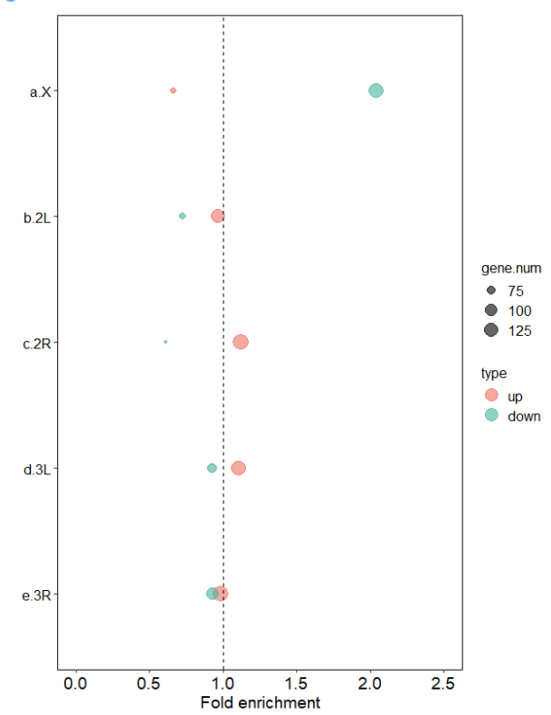

### Fold enrichment of diff TE genes in Chr

.

I need to ceate a plot which showing the enrichment fold of TE genes compared to genome annoted genes on each chomosome of drosophila.

.

the calculation method for the fold enrichment is as follows:


.

the input data

```R
# ------
library(readxl)
setwd("E:/220625_PC/R workplace/220320_SXL/202404_Fig/250126")
chr_dT <- read_xlsx("chr_distrib_250126_绝对翻译.xlsx",sheet = "absolute_transla",skip = 0)
chr_dT$group <- "dT"

#
chr_dT_up <- chr_dT[,c("chr","gene_up","enirch_up","group")]
chr_dT_down <- chr_dT[,c("chr","gene_down","enrich_down","group" )]

chr_dT_up$type <- "up"
chr_dT_down$type <- "down"

colnames(chr_dT_up) <- c("chr","gene.num","enrich_fold","group","type")
colnames(chr_dT_down) <- c("chr","gene.num","enrich_fold","group","type")


plot_dT <- rbind(chr_dT_up,
                 chr_dT_down)
plot_dT$chr[plot_dT$chr == "X"] <- "a.X"
plot_dT$chr[plot_dT$chr == "2L"] <- "b.2L"
plot_dT$chr[plot_dT$chr == "2R"] <- "c.2R"
plot_dT$chr[plot_dT$chr == "3L"] <- "d.3L"
plot_dT$chr[plot_dT$chr == "3R"] <- "e.3R"

plot_dT$chr <- factor(plot_dT$chr, levels = c("e.3R","d.3L","c.2R","b.2L","a.X"))
plot_dT$type <- factor(plot_dT$type, levels = c("up", "down"))

View(plot_dT)
```


.

plot

```R
# ------
library(ggplot2)
setwd("E:/220625_PC/R workplace/220320_SXL/202404_Fig/250210/")
tiff("50210_dT.tiff", units = "in", width = 7, height = 8, res = 900)
tiff("t_dT.tiff", units = "in", width = 7, height = 8, res = 900)
ggplot(plot_dT, aes(x = chr, y = enrich_fold, fill = type)) +
  geom_point(aes(size = gene.num, color = type), alpha = 0.6) +
  scale_fill_manual(values = c( "#EC7063","#45B39D")) + 
  scale_color_manual(values = c( "#EC7063","#45B39D")) +  
  coord_flip() +
  theme_bw() +
  theme(axis.text.x = element_text(angle = 0, hjust = 0.5, colour = "black", family = "blod", size = 14), 
        axis.text.y = element_text(family = "Times", size = 12, face = "plain", colour = "black"), 
        axis.title.y = element_text(family = "Times", size = 14, face = "plain"), 
        axis.title.x = element_text(family = "Times", size = 14, face = "plain"),
        panel.border = element_blank(),
        axis.line = element_line(colour = "black", size = 1),
        panel.grid.major = element_blank(),   
        panel.grid.minor = element_blank()) +
  theme(legend.text = element_text(size = 12)) + 
  theme(legend.title = element_text(size = 12)) + 
  guides(colour = guide_legend(override.aes = list(size=5)))+
  scale_size_continuous(range = c(1,6))+
  xlab(" ") + ylab("Fold enrichment") +
  theme(panel.border = element_rect(fill = NA, color = "black", size = 0.5, linetype = "solid")) +
  theme(axis.line.x = element_line(linetype = 1, color = "black", size = 0.5)) +
  theme(axis.line.y = element_line(linetype = 1, color = "black", size = 0.5)) +
  ylim(0, 2.5) +
  geom_hline(aes(yintercept = 1), color = "black", linetype = "dashed")
dev.off()

```


