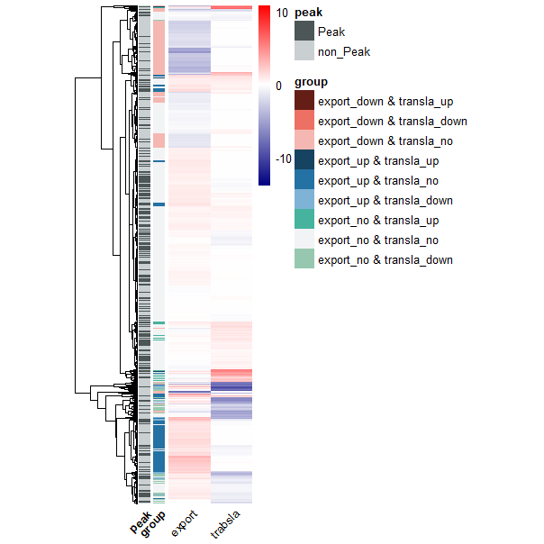

###  It’s case_when(), not ifelse() 

.

In order to create a groupings for the 'group' variable with multiple conditional, but  the nested `ifelse()` approach would become unwieldy. So, I implemented the `case_when()` function from the `dplyr` package, combined with `mutate()` to systematically handle all combinatorial scenarios

.

the input data

```R

# export nuclear
setwd("E:/220625_PC/R workplace/220320_SXL/202404_Fig/240508")
library(readxl)
new_FC <- read_xlsx("export_240508.xlsx",sheet = "new_FC",skip = 0)
FC_up <- read_xlsx("export_240508.xlsx",sheet = "FC_up",skip = 0)
FC_down <- read_xlsx("export_240508.xlsx",sheet = "FC_down",skip = 0)

# transla efficiency
setwd("E:/220625_PC/R workplace/220320_SXL/202404_Fig/250118")
library(readxl)
TE_S2 <- read_xlsx("transla_241023.xlsx",sheet = "T_S2",skip = 0)
TE_up <- read_xlsx("transla_241023.xlsx",sheet = "T_up",skip = 0)
TE_down <- read_xlsx("transla_241023.xlsx",sheet = "T_down",skip = 0)

# peak
setwd("E:/220625_PC/R workplace/220320_SXL/Fan.data/sxl_peak_bind_DEGs/20220328/")
peak_intersect_feature <- read.table("Sxl-bind-feature.txt",header = F)
colnames(peak_intersect_feature) <- c("peak.chr","peak.strat","peak.end","peak.xuhao","log10Pv","peak.strand","siteScore","V8",
                                      "chr","start","end","V12","ID_feature","strand")
peak <- peak_intersect_feature
library(stringr)
peak$GeneID <- str_split(peak$ID_feature,"\\_",simplify = T)[,1]
peak$transID <- str_split(peak$ID_feature,"\\_",simplify = T)[,2]
peak$feature <- str_split(peak$ID_feature,"\\_",simplify = T)[,3]
peak <- peak[peak$strand == peak$peak.strand,]

peak_gene <- peak[!duplicated(peak$GeneID),]

# merge
export_dat <- new_FC[,c("GeneID","gene_symbol","log2FC_Sxl.WT")]
transla_dat <- TE_S2[,c("GeneID","log2FoldChange")]
input_dat <- merge(export_dat,transla_dat,by="GeneID",all.x = TRUE)
input_dat[is.na(input_dat)] <- 0

```

.

Groups need to be classified according to the conditions of export and transla, and there are 9 cases in total.

```R
# group by case_when
library(dplyr)
input_dat <- 
  input_dat %>%
  mutate(
    export_group = case_when(
      input_dat$GeneID %in% FC_up$GeneID ~ "export_up",
      input_dat$GeneID %in% FC_down$GeneID ~ "export_down",
      TRUE ~ "export_no"),
    transla_group = case_when(
      input_dat$GeneID %in% TE_up$GeneID ~ "transla_up",
      input_dat$GeneID %in% TE_down$GeneID ~ "transla_down",
      TRUE ~ "transla_no"),
    group = paste(export_group, transla_group, sep = " & ")
  ) %>%
  select(-export_group, -transla_group)  

table(input_dat$group)

# 
input_dat$peak <- ifelse(input_dat$GeneID %in% peak_gene$GeneID,"Peak","non_Peak") %>% as.factor()
table(input_dat$peak)

# ------
# pheatmap
library(pheatmap)
paletteLength <- length(rownames(input_dat))
myColor <- colorRampPalette(c("navy", "white", "red"))(paletteLength)
myBreaks <- c(seq(min(input_dat$log2FoldChange), 
                  -0.1, 
                  length.out=ceiling(paletteLength/2) + 1), 
              seq(0, 
                  max(input_dat$log2FoldChange),
                  length.out=floor(paletteLength/2)
              ))

annotation_row <- input_dat[,c("gene_symbol","group","peak")]
row.names(annotation_row) <- input_dat$gene_symbol
annotation_row$group <- as.factor(annotation_row$group)
annotation_row$peak <- as.factor(annotation_row$peak)
annotation_row  <- annotation_row[,-1]

groupcolor <- c('#641E16','#EC7063','#F5B7B1','#154360','#2471A3','#7FB3D5','#45B39D','#F2F3F4','#97C8AF')
names(groupcolor) <- c('export_down & transla_up',
                       'export_down & transla_down',
                       'export_down & transla_no',
                       'export_up & transla_up',
                       'export_up & transla_no',
                       'export_up & transla_down',
                       'export_no & transla_up',
                       'export_no & transla_no',
                       'export_no & transla_down')

peakcolor <- c('#4D5656','#CACFD2')
names(peakcolor) <- c("Peak","non_Peak")                      
ann_colors <- list(group=groupcolor, 
                   peak= peakcolor) 

rownames(input_dat) <- input_dat$gene_symbol
plot_dat <- input_dat[,c("log2FC_Sxl.WT","log2FoldChange")]
colnames(plot_dat) <- c("export","trabsla")

# 1). cluster sorting by raw_clstuer (log2FC_S2)  ref: https://zhuanlan.zhihu.com/p/426355974
row_dist = dist(plot_dat)
hclust_1 <- hclust(row_dist)
# plot(hclust_1, cex = 1, hang = -1)
dend = reorder(as.dendrogram(hclust_1), wts=plot_dat$log2FoldChange*(-1))
row_cluster <- as.hclust(dend)

setwd("E:/220625_PC/R workplace/220320_SXL/202404_Fig/250221/")
pdf("heatmap_export_transla.pdf",width = 6,height = 8)
pheatmap(plot_dat,
         cluster_row = T,
         cluster_col=F,
         cutree_rows=1,
         cutree_cols =2,
         treeheight_row=50,
         legend_breaks=c(-10,0,10),
         breaks = myBreaks,
         show_rownames = F,
         angle_col = 45,
         cellwidth = 35,
         border_color = NULL,
         color = myColor,
         annotation_row = annotation_row,
         annotation_colors = ann_colors,
         cluster_rows = row_cluster)
dev.off()


```

.

output_draw


