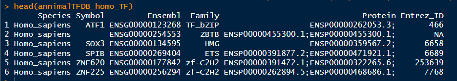
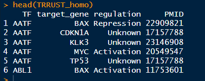

### Transcript factor annotation for target genes

.

First, I downloaded the data on human transcription factors and their target genes from https://www.grnpedia.org/trrust/downloadnetwork.php, as shown in the picture below.


.

and downloaded the table that lists transcription factors and their corresponding transcription factor families from https://guolab.wchscu.cn/AnimalTFDB4//#/Download, as illustrated below:


.

the pipeline of TF_annotation of DEGs is as follows.

```R
# 1) download TF_target
# https://www.grnpedia.org/trrust/downloadnetwork.php
# 2) download TF_family
# https://guolab.wchscu.cn/AnimalTFDB4//#/Download

# TF for DEGs
setwd("E:/220625_PC/R workplace/230922_HJ/250305_TF/")
annimalTFDB_homo_TF <- read.table("animalTFDB_Homo_sapiens_TF.txt", sep = '\t', fill = TRUE,header = T) 
head(annimalTFDB_homo_TF)
TRRUST_homo <- read.table("trrust_rawdata.human.tsv", fill = TRUE,header = F) 
colnames(TRRUST_homo) <- c("TF","target_gene","regulation","PMID")
head(TRRUST_homo)

length(intersect(TRRUST_homo$TF,annimalTFDB_homo_TF$Symbol))
```





.

load your genes (target genes)

```R
# DEGs
setwd("E:/220625_PC/R workplace/230922_HJ/250305_TF/Differentially_expressed_gene/Diff_exp/")
library(readxl)
df_GFP.VEGF_shSND1.VEGF<- read_xlsx("df_GFP.VEGF_shSND1.VEGF.xlsx",sheet = "gene_diff",skip = 0 ) 
colnames(df_GFP.VEGF_shSND1.VEGF) <- c('gene_symbol','log2FC','pvalue')
df_GFP.VEGF_shSND1.VEGF$log2FC <- as.numeric(df_GFP.VEGF_shSND1.VEGF$log2FC)
df_GFP.VEGF_shSND1.VEGF$pvalue <- as.numeric(df_GFP.VEGF_shSND1.VEGF$pvalue)
DEG_GFP.VEGF_shSND1.VEGF <- df_GFP.VEGF_shSND1.VEGF[abs(df_GFP.VEGF_shSND1.VEGF$log2FC) >1 & 
                                                      df_GFP.VEGF_shSND1.VEGF$pvalue < 0.05,]

length(intersect(TRRUST_homo$target_gene,DEG_GFP.VEGF_shSND1.VEGF$gene_symbol))

```

.

merge the table and get the target genes of TF

```R
# merge TF and target genes
TF_target <- TRRUST_homo[,1:3]
colnames(TF_target) <- c('Symbol','gene_symbol','regulate') # Symbol is TF and gene_symbol is target_genes

DEG_tf <- merge(TF_target ,DEG_GFP.VEGF_shSND1.VEGF,by="gene_symbol",all.y = T) # gene_symbol is target_genes
DEG_tf <- na.omit(DEG_tf)
length(unique(DEG_tf$gene_symbol))

# mergr TF and TF_family
DEG_tf_family <- merge(DEG_tf,annimalTFDB_homo_TF,by='Symbol',all.x = T)
DEG_tf_family <- na.omit(DEG_tf_family)

length(unique(DEG_tf_family$gene_symbol))
table(DEG_tf_family$Family)

write.csv(DEG_tf_family,file = 'DEG_tf_family.csv')
```


