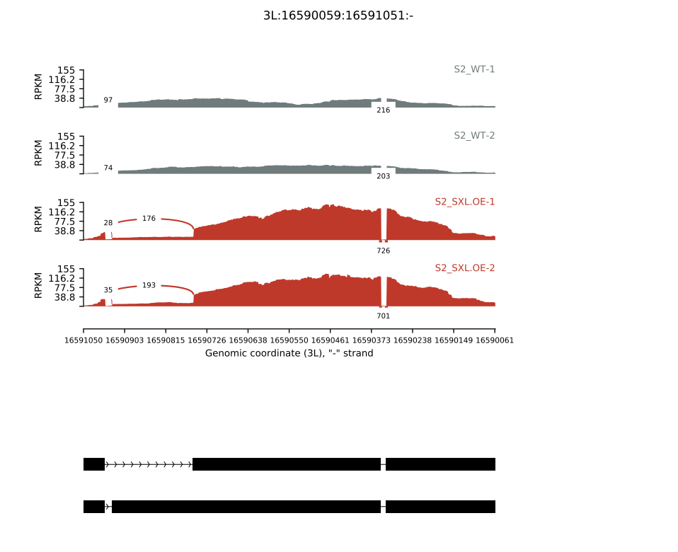

### rmats2sashimiplot for AS-events

.

rmats2sashimiplot produces a sashimiplot visualization of [rMATS](https://github.com/Xinglab/rmats-turbo)  output files.

and  rmats2sashimiplot can also produce plots using an annotation file and genomic coordinates for target_region.

.

the input data

```shell
# annotation_files 
Drosophila_melanogaster.BDGP6.22.42.gff3

# bam file
# ctrl_group
S2-V1.hisat.bam
S2-V2.hisat.bam
# treat_group
S2-S1.hisat.bam
S2-S2.hisat.bam

# location of tra in *gff3 
3L:-:16590059:16591050
```


.

plot

```shell
conda activate py2
# tra
rmats2sashimiplot 
--b1 S2-V1.hisat.bam,S2-V2.hisat.bam  
--b2 S2-S1.hisat.bam,S2-S2.hisat.bam 
-c 3L:-:16590059:16591050:./Drosophila_melanogaster.BDGP6.22.42.gff3  
--l1 S2_WT 
--l2 S2_SXL.OE 
--color "#707B7C,#707B7C,#C0392B,#C0392B"  
--exon_s 1 
--intron_s 5 
-o S2_tra
```


.




