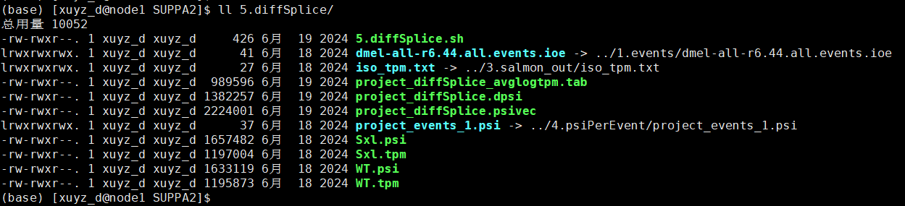

### SUPPA2 for alternative splicing 


.

SUPPA2 is a fast, accurate, and uncertainty-aware for differential splicing analysis across multiple conditions.

SUPPA2 uses transcript quantification to compute inclusion values (PSI) of alternative splicing events across multiple samples.

https://genomebiology.biomedcentral.com/articles/10.1186/s13059-018-1417-1

```shell
# 1.generateEvents.sh
python3 /data1/amliang/home/biosoft/SUPPA/SUPPA-2.3/suppa.py  generateEvents -i ../../dmel-all-r6.44.gtf  -l 24 -o dm6 -e SE SS MX RI FL -f ioe
awk 'FNR==1 && NR!=1 { while (/^<header>/) getline; } 1 {print}' *.ioe > dmel-all-r6.44.all.events.ioe
```

.


.


```shell
# 2.salmon.sh
wget -c https://ftp.flybase.net/genomes/Drosophila_melanogaster/dmel_r6.44_FB2022_01/fasta/dmel-all-transcript-r6.44.fasta.gz # loaddown transcript seq fasta
source activate py2
salmon index -t dmel-all-transcript-r6.44.fasta  -i index 

```


.


.

```shell
# fasta.gz 
ln -s/data1/amliang/projects/sxl_DC/220418_Sxl.vel_RNA_Seq/rawdata/cleandata/*gz ./

# 3.salmon.quatil.sh
source activate py2

index=/data1/amliang/projects/sxl_DC/220418_Sxl.vel_RNA_Seq/SUPPA2/salmon_index/index/
ls *gz|cut -d"_" -f 1|sort -u |while read id;do
salmon quant -i $index -l ISF --gcBias -1 ${id}_1.fq.gz -2 ${id}_2.fq.gz -p 2  -o ./${id}_output 1>${id}_salmon.log 2>&1 &
 done

#
python3 /data1/amliang/home/biosoft/SUPPA/SUPPA-2.3/multipleFieldSelection.py -i *_output/quant.sf -k 1 -f 4 -o iso_tpm.txt

#mkdir merge_quant
#cd merge_quant
#ln -s ../*quant.sf ./
#conda deactivate 
#python /data1/amliang/python_prj/merge.TPM.py WT1_quant.sf WT2_quant.sf WT3_quant.sf Sxl1_quant.sf Sxl2_quant.sf Sxl3_quant.sf  merge_quant.txt

```

.


.


```shell
# 4.psiPerEvent.sh
ln -s ../3.salmon_out/merge_quant/merge_quant.txt ./
ln -s ../3.salmon_out/iso_tpm.txt ./
ln -s ../1.events/dmel-all-r6.44.all.events.ioe ./

#
python3 /data1/amliang/home/biosoft/SUPPA/SUPPA-2.3/suppa.py psiPerEvent -i dmel-all-r6.44.all.events.ioe -e iso_tpm.txt -o project_events_1 1>psiPerEvent_log_1.txt 2>&1
```

.


.

less project_event_1.psi


.

```shell
# 5.diffSplice.sh

ln -s ../1.events/dmel-all-r6.44.all.events.ioe ./
ln -s ../3.salmon_out/iso_tpm.txt ./
ln -s ../4.psiPerEvent/project_events_1.psi ./

#
cut -f 1-4 project_events_1.psi > Sxl.psi
cut -f 1-4 iso_tpm.txt > Sxl.tpm

cut -f 1,5-7 project_events_1.psi > WT.psi
cut -f 1,5-7 iso_tpm.txt > WT.tpm

#
#
python3 /data1/amliang/home/biosoft/SUPPA/SUPPA-2.3/suppa.py diffSplice -m empirical -gc -i dmel-all-r6.44.all.events.ioe --save_tpm_events -p WT.psi Sxl.psi -e WT.tpm Sxl.tpm -o project_diffSplice 

cat project_diffSplice.dpsi|perl -alne '{print if $F[2] <0.05}' |less
```

.



.

```shell
# 6.generate.isoform.sh
python3 /data1/amliang/home/biosoft/SUPPA/SUPPA-2.3/suppa.py  generateEvents -i ../../dmel-all-r6.44.gtf -f ioi -o dmel-all-r6.44.isoforms
```

.

.

```shell
# 7.psiPerIsoform.sh

ln -s ../6.generate.isoform/dmel-all-r6.44.isoforms.ioi ./
ln -s ../3.salmon_out/iso_tpm.txt ./

#
python3 /data1/amliang/home/biosoft/SUPPA/SUPPA-2.3/suppa.py  psiPerIsoform -g ../../dmel-all-r6.44.gtf -e iso_tpm.txt -o iso

#
awk -v OFS='\t' '{if (NR == 1) {print $1,$2,$3} else {print $1,$2,$3,$4}}' iso_isoform.psi > Sxl_iso.psi
awk -v OFS='\t' '{if (NR == 1) {print $4,$5,$6} else {print $1,$5,$6,$7}}' iso_isoform.psi > WT_iso.psi

```

.


.

```shell
# 8.diffSplice.iso.sh

ln -s ../5.diffSplice/WT.tpm ./
ln -s ../5.diffSplice/Sxl.tpm ./
ln -s ../7.psiPerIsoform/dmel-all-r6.44.isoforms.ioi ./
ln -s ../7.psiPerIsoform/iso_isoform.psi ./
ln -s ../7.psiPerIsoform/Sxl_iso.psi ./
ln -s ../7.psiPerIsoform/WT_iso.psi ./

#
python3 /data1/amliang/home/biosoft/SUPPA/SUPPA-2.3/suppa.py  diffSplice -m empirical -gc -i dmel-all-r6.44.isoforms.ioi  -p WT_iso.psi Sxl_iso.psi -e  WT.tpm Sxl.tpm -o S2_diffSplice_iso

#
cat S2_diffSplice_iso.dpsi|perl -alne '{print if $F[2] <0.01}' | less

```

.


.


```R
setwd("E:/220625_PC/R workplace/220320_SXL/202404_Fig/240726_SUPPA2.AS/S2/")
suppa_AS <- read.table("project_diffSplice.dpsi",header = T,sep = "\t")
suppa_AS$ID <- rownames(suppa_AS)
suppa_AS <- suppa_AS[suppa_AS$WT.Sxl_p.val < 0.05,]
suppa_AS$GeneID <- str_split(suppa_AS$ID,"\\;",simplify = T)[,1]

write.csv(suppa_AS,file = "suppa_AS.csv")

```


.
