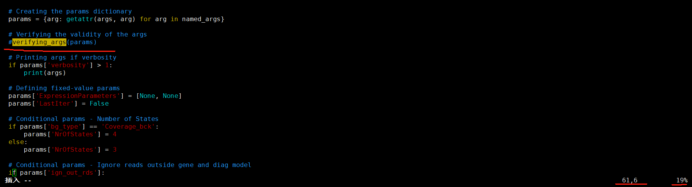

### Peak calling for CLIP-Seq data by omniCLIP [1]

.


 I have used omniCLIP to analyze CLIP data a few months ago, but the software is poorly maintained. The author is also incompetent, as they didn’t even clearly explain the output files. 

Although the software is quite bad, I still want to record how to use it.


-------------------------------------------------------------------------------------------


I have skimmed through this papers (about the omniCLIP), and now I will provide a brief explanation of its computational principles and algorithm.

This paper ( Philipp et. al. 2018,Genome biology)  employ a Non-Homogeneous Hidden Markov Model (NHMM) to segment the genome into peaks and non-peaks. The emission probability of the NHMM is given by the product of the joint probability of the coverage and the probability of the observed diagnostic event frequency in all replicate CLIP and background libraries.

And a Negative Binomial based Generalized Linear Model (that models both confounding by the gene expression, and confounding of local effects and also allows to account for excess variance) are used to model the reads coverage.

Besides, the diagnostic events are modeled using a Dirichlet-Multinomial mixture model. The transition probabilities of the model are based on a logistic function that depends on the coverage. 


#####    The diagram below illustrates the algorithmic of omniCLIP.


show on the (left) is peak calling for a lowly expressed genes with strong RNA binding protein (RBP) RNA-binding and on the (right) a highly expressed gene with weak RBP RNA-binding. During peak calling, local background coverage is taken into account to correct for confounding by local effects or biases. Furthermore, overall the RNA abundance is estimated and accounted for. This allows better ranking peaks with identical local coverage by sharing of information along the transcript, as illustrated for the leftmost peaks in both genes.  


-----------------------------------------------------------------------------------------------------


### 1. data preparation


#### 1.1). data 

**GSE98188** from paper : 

  Drosophila Sister-of-Sex-lethal reinforces a male-specific gene expression pattern by controlling Sex-lethal alternative splicing.  

  *Nucleic Acids Res* 2019


 **data download** 

```shell
# iCLIP in SL2 cells
lftp -e 'pget -n 15 -c "ftp://ftp.sra.ebi.ac.uk/vol1/fastq/SRR548/007/SRR5480967/SRR5480967.fastq.gz";exit' # Similar methods for other samples.
```


#### 1.2). data clean

 **Since the paper did not provide the adapter sequences and the length and position of the UMI**.

 I  tried different methods  to mark and remove the UMI and adapter.


 **a). remove adapter**

To detect the adapter sequences used, I first processed the raw sequencing data with trim_galore.

```shell
ls ../*fastq.gz |while read id;do (trim_galore --quality 20  --length 20 -o ./ $id);done
```


Based on the "auto-detection adapter" in the above figure, we can infer that the adapter sequence is AGATCGGAAGAGC.

The same processing method was applied to the other samples as well.   

Therefore,  removing the adapter from the raw sequence data based on the sequences identified above.

```shell
for i in *.fastq.gz;
do
id=${i%.fastq.gz}
echo $i,$id
cutadapt -q 25 -a AGATCGGAAGAGC  --overlap=3 -n 1 -m 24 -o ${id}_cutadap.fastq.gz  ${id}.fastq.gz
done
```


 **b). mark UMI**

 I used the adapters-removed reads for a BLAST against the genome in flybase and found that there are always 10 unpaired  bases at the 5' end of the reads. Therefore, I suspect these are the UMI, as shown in the figure below.

​	read-@SRR5480967.11 11/1   length = 53 bp                                


​	read-@SRR5480967.218 218/1   length = 51 bp


Next, I used the **flexbar** software to mark the UMIs in the reads.

```shell
cat >  barcodes.fa   # create a file, with 10 N (length of UMI is 10 bp)
>umi
NNNNNNNNNN
```


```shell
conda activate py39

for i in *_cutadapt.fastq.gz;
do
id=${i%_cutadapt.fastq.gz}
echo $i,$id
flexbar -r ${id}_cutadapt.fastq.gz  -b barcodes.fa --umi-tags -t ${id} -z GZ
done
```


### 2.omniCLIP for CLIP-Seq peaks calling


#### 2.1). intsall omniCLIP

**download**

```shell
git clone https://github.com/philippdre/omniCLIP.git 
```

**create conda env** 

```shell
cd omniCLIP/
conda env create -f environment.yml
conda activate omniEnv
```

**install** 

```shell
python3 setup.py install
```


#### 2.2). build a db files of annotation gtf

```shell
cd /home/xuyz_g/soft/omniCLIP # programs can only run successfully in directory of omniCLIP，don't know why

omniCLIP generateDB --gff-file /data1/amliang/annotation/fly/Drosophila_melanogaster.BDGP6.22.42.gff3 --db-file /data1/amliang/annotation/fly/flyase/gff/omniCLIP/dmel-all-r6.45.gff.db # 

# At the same time, you also need to prepare a reference genome sequence and divide it into chromosomes
# like this in : /data3/tmp_g/genome_anno/fly/genome/chroms
  2L.fa.gz
  2R.fa.gz
  3L.fa.gz
  3R.fa.gz
  4.fa.gz
  X.fa.gz
  Y.fa.gz
```

#### 	error 

```shell
# 1) If an error message appears saying that like this:
#    FileNotFoundError: [Errno 2] No such file or directory: 'version.py', 
#	 just copy it from another directory to this directory.
cp /data1/tmp/soft/omniCLIP/version.py  yourPath/omniCLIP-0.2.0-py3.8-linux-x86_64.egg/omniCLIP/

# 2) if a error shows: 
#	 File "yourPath/omniCLIP/data_parsing/ParsingArgs.py", line 44, in parsing_argparse
#    NameError: name 'verifying_args' is not defined
#	Just vim into ParsingArgs.py and comment out or delete this line of verifying_args : like picture
```




#### 2.3). parsing the background files 

###### 		(Usually RNA-SEQ data, but sometimes input data is used)

```shell
omniCLIP parsingBG --db-file /data3/tmp_g/projects/omniCLIP/dmel-all-r6.45.gff.db --genome-dir /data3/tmp_g/projects/omniCLIP/chroms/ --bg-files /data3/tmp_g/projects/SSX_CLIP/4.peak/Ctrl_IP1.bam --bg-files /data3/tmp_g/projects/SSX_CLIP/4.peak/Ctrl_IP2.bam  --out-file /data3/tmp_g/projects/SSX_CLIP/4.peak/CTRL.dat
```


#### 2.4). parsing the CLIP files 

```shell
omniCLIP parsingCLIP --db-file /data3/tmp_g/projects/omniCLIP/dmel-all-r6.45.gff.db --genome-dir /data3/tmp_g/projects/omniCLIP/chroms/ --clip-files /data3/tmp_g/projects/SSX_CLIP/4.peak/Ssx_IP1.bam  --clip-files /data3/tmp_g/projects/SSX_CLIP/4.peak/Ssx_IP2.bam  --out-file /data3/tmp_g/projects/SSX_CLIP/4.peak/SSX.dat
```


#### 2.5). Running the omniCLIP algorithm

```shell
omniCLIP run_omniCLIP --db-file /data3/tmp_g/projects/omniCLIP/dmel-all-r6.45.gff.db  --bg-dat /data3/tmp_g/projects/SSX_CLIP/4.peak/CTRL.dat  --clip-dat /data3/tmp_g/projects/SSX_CLIP/4.peak/SSX.dat  --out-dir /data3/tmp_g/projects/SSX_CLIP/4.peak/reslut
```

